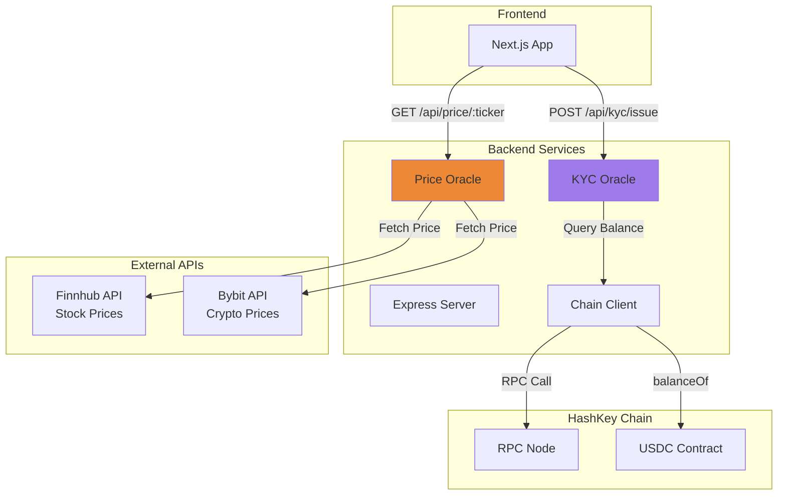
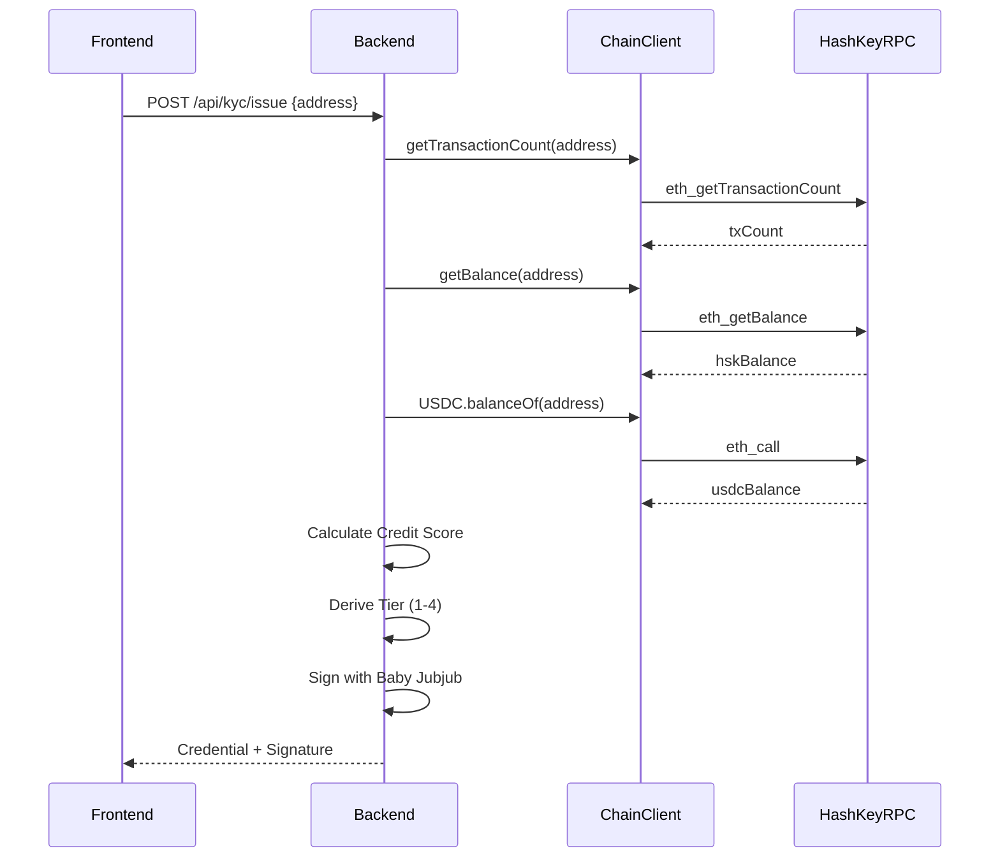
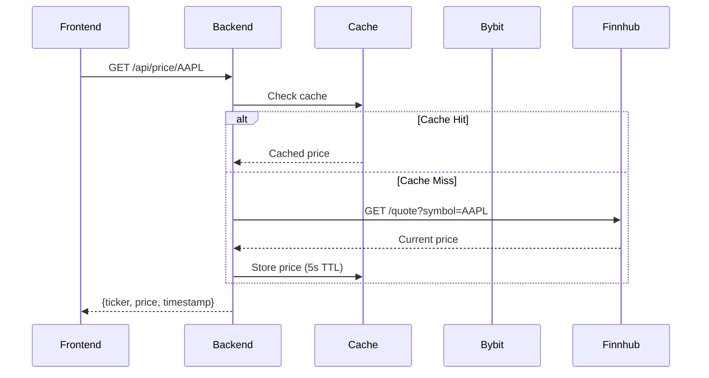

# zkSynth Backend Server

> **Express.js backend services for zkSynth Access**

Simple Express.js backend server for zkSynth with two main functions:

1. **KYC Oracle** - Signs KYC credentials with Baby Jubjub EdDSA for ZK proof generation
2. **Price Oracle** - Provides real-time prices for synthetic assets (stocks + crypto)

---

## 📋 Table of Contents

- [Architecture](#architecture)
- [Features](#features)
- [Quick Start](#quick-start)
- [API Endpoints](#api-endpoints)
- [Credit Score Model](#credit-score-model)
- [Deployment](#deployment)

## 🏗️ Architecture



---

## ✨ Features

- ✅ **KYC Oracle**: Baby Jubjub EdDSA credential signing for ZK proofs
- ✅ **Credit Score Model**: On-chain behavior analysis (tx count, HSK balance, USDC balance)
- ✅ **Price Feeds**: Bybit (crypto) + Finnhub (stocks) with mock fallback
- ✅ **HashKey Chain RPC**: Query transaction counts and token balances
- ✅ **CORS Enabled**: Ready for frontend integration
- ✅ **Request Logging**: Automatic request/response logging
- ✅ **Error Handling**: Graceful error responses

## Quick Start

### 1. Install Dependencies

```bash
cd backend
npm install
```

### 2. Configure Environment

Copy `.env.example` to `.env`:

```bash
cp .env.example .env
```

**Required variables:**
- `ORACLE_PRIVATE_KEY` - Baby Jubjub EdDSA private key (hex format)
- `HASHKEY_RPC_URL` - HashKey Testnet RPC URL (default: https://testnet.hsk.xyz)

**Optional variables:**
- `FINNHUB_API_KEY` - For real stock prices (uses mock prices if not provided)
- `BYBIT_API_KEY` - For real crypto prices (uses mock prices if not provided)

### 3. Run Development Server

```bash
npm run dev
```

Server will start on `http://localhost:3001`

### 4. Build for Production

```bash
npm run build
npm start
```

## API Endpoints

### Health Check

```bash
GET /health
```

Returns server status and uptime.

### KYC Oracle

#### Sign KYC Credential

```bash
POST /api/kyc/issue
Content-Type: application/json

{
  "address": "0x742d35Cc6634C0532925a3b844Bc9e7595f0bEb"
}
```

**Response:**
```json
{
  "address": "0x742d35Cc6634C0532925a3b844Bc9e7595f0bEb",
  "tier": 2,
  "expiry": "1746057600",
  "nonce": "12345...",
  "sigR8x": "...",
  "sigR8y": "...",
  "sigS": "...",
  "pubKeyAx": "...",
  "pubKeyAy": "..."
}
```

#### Query KYC Tier

```bash
GET /api/kyc/:address
```

### Price Oracle

#### Get Single Price

```bash
GET /api/price/BTC
GET /api/price/AAPL
```

**Response:**
```json
{
  "ticker": "BTC",
  "price": 65000,
  "timestamp": 1704067200000
}
```

#### Get Multiple Prices

```bash
GET /api/price?tickers=BTC,ETH,AAPL,TSLA
```

**Response:**
```json
{
  "prices": [
    { "ticker": "BTC", "price": 65000, "timestamp": 1704067200000 },
    { "ticker": "ETH", "price": 3500, "timestamp": 1704067200000 },
    { "ticker": "AAPL", "price": 180, "timestamp": 1704067200000 },
    { "ticker": "TSLA", "price": 250, "timestamp": 1704067200000 }
  ]
}
```

**Supported Assets:**
- **Crypto**: BTC, ETH, SOL, LINK, SUI, DOGE, XRP, AVAX
- **Stocks**: AAPL, TSLA, GOOGL, NVDA, MSFT, AMZN, META, NFLX

## Architecture

```
backend/
├── src/
│   ├── index.ts              # Express server entry point
│   ├── lib/
│   │   └── chainClients.ts   # HashKey Chain RPC client
│   └── routes/
│       ├── kyc.ts            # KYC oracle endpoints
│       └── price.ts          # Price oracle endpoints
├── package.json
├── tsconfig.json
└── .env.example
```

## 🔄 How It Works

### KYC Oracle Flow



### Price Oracle Flow



---

## 💯 Credit Score Model

The backend computes a credit score (0-100) from on-chain behavior to derive KYC tiers.

### Score Components

```typescript
// Transaction activity score (60% weight)
txScore = log10(txCount + 1) / log10(301) * 100

// Native HSK balance score (20% weight)
balanceScore = log10(hskBalance + 1) / log10(21) * 100

// USDC balance score (20% weight)
usdcScore = log10(usdcBalance + 1) / log10(100001) * 100

// Weighted credit score
creditScore = round(txScore * 0.6 + balanceScore * 0.2 + usdcScore * 0.2)
```

### Tier Mapping

| Credit Score | Tier | Max Leverage | Description |
|--------------|------|--------------|-------------|
| 0-34 | 1 | 2x | Basic KYC |
| 35-59 | 2 | 5x | Accredited Investor |
| 60-79 | 3 | 8x | Premium / High Net Worth |
| 80-100 | 4 | 10x | Institutional / QIB |

### Example Calculation

```
User Wallet:
- Transaction Count: 150
- HSK Balance: 5.2 HSK
- USDC Balance: 1000 USDC

Scores:
- txScore = log10(151) / log10(301) * 100 = 87.8
- balanceScore = log10(6.2) / log10(21) * 100 = 60.5
- usdcScore = log10(1001) / log10(100001) * 100 = 60.0

Credit Score:
= 87.8 * 0.6 + 60.5 * 0.2 + 60.0 * 0.2
= 52.68 + 12.1 + 12.0
= 76.78
≈ 77

Tier: 3 (60-79 range)
Max Leverage: 8x
```

## Environment Variables

| Variable | Description | Required |
|----------|-------------|----------|
| `PORT` | Server port | No (default: 3001) |
| `HOST` | Server host | No (default: 0.0.0.0) |
| `ORACLE_PRIVATE_KEY` | Baby Jubjub EdDSA key | Yes |
| `HASHKEY_RPC_URL` | HashKey Testnet RPC | Yes |
| `BYBIT_API_KEY` | Bybit API key | No |
| `FINNHUB_API_KEY` | Finnhub API key | No |
| `KYC_SBT_ADDRESS` | KYC SBT contract address | No (has default) |
| `FRONTEND_URL` | Frontend URL for CORS | No (default: http://localhost:3000) |

## Testing

```bash
# Test health check
curl http://localhost:3001/health

# Test KYC oracle
curl -X POST http://localhost:3001/api/kyc/issue \
  -H "Content-Type: application/json" \
  -d '{"address":"0x742d35Cc6634C0532925a3b844Bc9e7595f0bEb"}'

# Test price oracle
curl http://localhost:3001/api/price/BTC
curl http://localhost:3001/api/price?tickers=BTC,ETH,AAPL
```

## Deployment

### Render

1. Create new Web Service
2. Connect your GitHub repo
3. Set build command: `cd backend && npm install && npm run build`
4. Set start command: `cd backend && npm start`
5. Add environment variables from `.env.example`

### Railway

1. Create new project
2. Connect GitHub repo
3. Set root directory: `backend`
4. Railway will auto-detect and deploy

## 🔐 Security

### Oracle Key Management

⚠️ **Critical:** Never commit `ORACLE_PRIVATE_KEY` to version control.

**Best Practices:**
1. Generate keypair with `contracts/scripts/gen-oracle-key.ts`
2. Store private key in `.env` (gitignored)
3. Use environment variables in production (Render, Railway, etc.)
4. Rotate keys if exposed

### CORS Configuration

Default CORS allows `http://localhost:3000`. Update `FRONTEND_URL` for production:

```bash
FRONTEND_URL=https://zksynth.vercel.app
```

### Rate Limiting

Consider adding rate limiting for production:

```typescript
import rateLimit from 'express-rate-limit';

const limiter = rateLimit({
  windowMs: 15 * 60 * 1000, // 15 minutes
  max: 100 // limit each IP to 100 requests per windowMs
});

app.use('/api/', limiter);
```

---

## 🧪 Testing

### Manual Testing

```bash
# Health check
curl http://localhost:3001/health

# KYC oracle
curl -X POST http://localhost:3001/api/kyc/issue \
  -H "Content-Type: application/json" \
  -d '{"address":"0x742d35Cc6634C0532925a3b844Bc9e7595f0bEb"}'

# Price oracle
curl http://localhost:3001/api/price/BTC
curl http://localhost:3001/api/price?tickers=BTC,ETH,AAPL
```

### Automated Testing (Future)

Recommended testing stack:

- **Unit Tests:** Jest
- **Integration Tests:** Supertest
- **E2E Tests:** Playwright

---

## 📊 Monitoring

### Request Logging

All requests are logged with:
- Timestamp
- Method
- Path
- Status code
- Duration (ms)

Example:
```
[2026-04-15T10:30:45.123Z] POST /api/kyc/issue 200 1234ms
```

### Error Logging

Errors are logged to console with stack traces in development mode.

---

## 🚀 Performance

### Price Caching

Prices are cached for 5 seconds to reduce API calls:

```typescript
const CACHE_DURATION = 5000; // 5 seconds
```

Adjust `CACHE_DURATION` based on your needs:
- Lower (1-2s) for high-frequency trading
- Higher (10-30s) for casual trading

### Connection Pooling

Viem public clients use connection pooling by default. No additional configuration needed.

---

## 📚 Additional Resources

- [Express.js Docs](https://expressjs.com/)
- [Viem Docs](https://viem.sh/)
- [Baby Jubjub Curve](https://eips.ethereum.org/EIPS/eip-2494)
- [Poseidon Hash](https://www.poseidon-hash.info/)

---

## 📞 Support

For backend-specific questions:
- Review API endpoint examples above
- Check logs in console output
- Consult [Express.js docs](https://expressjs.com/)

---

## 📄 License

MIT

---

**Built with ❤️ for the HashKey Hackathon 2026**
