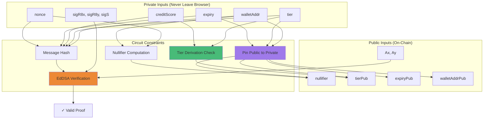

# zkSynth Circuits

> **Circom ZK circuits for privacy-preserving KYC tier verification**

This directory contains the Circom circuits that enable zero-knowledge proof generation for KYC tier verification without revealing personal identity data.

---

## 📋 Table of Contents

- [Overview](#overview)
- [Circuit Architecture](#circuit-architecture)
- [Setup](#setup)
- [Circuit Details](#circuit-details)
- [Proof Generation](#proof-generation)
- [Verification](#verification)

---

## 🎯 Overview

The `tier_proof.circom` circuit proves that a user possesses a valid KYC credential signed by a trusted oracle, without revealing:
- Personal identity information
- Credit score details
- Wallet transaction history
- Token balances

**What is proven:**
- ✅ Oracle signature is valid (EdDSA Baby Jubjub + Poseidon)
- ✅ Tier is correctly derived from credit score bands
- ✅ Credential has not expired
- ✅ Proof is for the connected wallet address
- ✅ Nullifier prevents replay attacks

**What is revealed (public signals):**
- Nullifier (anti-replay)
- Tier (1-4)
- Expiry timestamp
- Wallet address
- Oracle public key

---

## 🏗️ Circuit Architecture



---

## 🚀 Setup

### Prerequisites

- Node.js 20+
- Circom 2.1.0+
- snarkjs 0.7.6+
- PowerShell (Windows) or Bash (Linux/Mac)

### Installation

```bash
cd circuits
npm install
```

### Compile Circuit

#### Windows (PowerShell)

```powershell
.\scripts\setup.ps1
```

#### Linux/Mac (Bash)

```bash
chmod +x scripts/setup.sh
./scripts/setup.sh
```

### Setup Script Steps

The setup script performs:

1. **Compile Circuit**
   ```bash
   circom tier_proof.circom --r1cs --wasm --sym -o build
   ```

2. **Powers of Tau Ceremony**
   ```bash
   snarkjs powersoftau new bn128 14 pot14_0000.ptau
   snarkjs powersoftau contribute pot14_0000.ptau pot14_0001.ptau
   snarkjs powersoftau prepare phase2 pot14_0001.ptau pot14_final.ptau
   ```

3. **Groth16 Setup**
   ```bash
   snarkjs groth16 setup tier_proof.r1cs pot14_final.ptau tier_proof_0000.zkey
   snarkjs zkey contribute tier_proof_0000.zkey tier_proof_0001.zkey
   snarkjs zkey export verificationkey tier_proof_0001.zkey verification_key.json
   ```

4. **Export Verifier Contract**
   ```bash
   snarkjs zkey export solidityverifier tier_proof_0001.zkey Groth16Verifier.sol
   cp Groth16Verifier.sol ../contracts/src/
   ```

5. **Copy Artifacts to Frontend**
   ```bash
   cp build/tier_proof_js/tier_proof.wasm ../frontend/public/circuits/
   cp tier_proof_0001.zkey ../frontend/public/circuits/
   cp verification_key.json ../frontend/public/circuits/
   ```

---

## 🔬 Circuit Details

### File: `tier_proof.circom`

```circom
pragma circom 2.1.0;

include "node_modules/circomlib/circuits/poseidon.circom";
include "node_modules/circomlib/circuits/eddsaposeidon.circom";
include "node_modules/circomlib/circuits/comparators.circom";

template TierProof() {
    // Private signals (never leave the user's device)
    signal input walletAddr;
    signal input tier;
    signal input creditScore;
    signal input expiry;
    signal input nonce;
    signal input sigR8x;
    signal input sigR8y;
    signal input sigS;

    // Public signals (committed on-chain)
    signal input nullifier;
    signal input tierPub;
    signal input expiryPub;
    signal input walletAddrPub;
    signal input Ax;
    signal input Ay;

    // ... constraints ...
}

component main { public [nullifier, tierPub, expiryPub, walletAddrPub, Ax, Ay] } = TierProof();
```

### Constraint Breakdown

#### 1. Pin Public Commitments to Private Values

```circom
walletAddrPub === walletAddr;
tierPub       === tier;
expiryPub     === expiry;
```

Ensures public signals match private inputs.

#### 2. Tier Derivation from Credit Score

```circom
// Range check: 0 <= creditScore <= 100
component scoreLt101 = LessThan(8);
scoreLt101.in[0] <== creditScore;
scoreLt101.in[1] <== 101;
scoreLt101.out === 1;

// Tier bands
isTier1 <== (creditScore < 35);
isTier2 <== (creditScore >= 35 && creditScore < 60);
isTier3 <== (creditScore >= 60 && creditScore < 80);
isTier4 <== (creditScore >= 80);

// Exactly one band selected
isTier1 + isTier2 + isTier3 + isTier4 === 1;

// Tier matches score band
tier === isTier1 + 2 * isTier2 + 3 * isTier3 + 4 * isTier4;
```

Proves tier is correctly derived from credit score:
- Score 0-34 → Tier 1
- Score 35-59 → Tier 2
- Score 60-79 → Tier 3
- Score 80-100 → Tier 4

#### 3. Nullifier Computation

```circom
component nullHash = Poseidon(2);
nullHash.inputs[0] <== nonce;
nullHash.inputs[1] <== walletAddr;
nullifier === nullHash.out;
```

Nullifier = `Poseidon(nonce, walletAddr)` prevents proof replay.

#### 4. Message Hash

```circom
component msgHash = Poseidon(5);
msgHash.inputs[0] <== walletAddr;
msgHash.inputs[1] <== tier;
msgHash.inputs[2] <== creditScore;
msgHash.inputs[3] <== expiry;
msgHash.inputs[4] <== nonce;
```

Message = `Poseidon(walletAddr, tier, creditScore, expiry, nonce)`

This is what the oracle signs.

#### 5. EdDSA Signature Verification

```circom
component sigVerify = EdDSAPoseidonVerifier();
sigVerify.enabled <== 1;
sigVerify.Ax      <== Ax;
sigVerify.Ay      <== Ay;
sigVerify.R8x     <== sigR8x;
sigVerify.R8y     <== sigR8y;
sigVerify.S       <== sigS;
sigVerify.M       <== msgHash.out;
```

Verifies oracle's Baby Jubjub signature on the message hash.

---

## 🔐 Proof Generation

### Browser-Side (Frontend)

```typescript
import { groth16 } from 'snarkjs';
import { buildPoseidon } from 'circomlibjs';

// 1. Fetch credential from backend
const credential = await fetch('/api/kyc/issue', {
  method: 'POST',
  body: JSON.stringify({ address: walletAddress })
}).then(r => r.json());

// 2. Compute nullifier
const poseidon = await buildPoseidon();
const nullifier = poseidon([
  BigInt(credential.nonce),
  BigInt(walletAddress)
]);

// 3. Prepare circuit inputs
const input = {
  // Private
  walletAddr: walletAddress,
  tier: credential.tier,
  creditScore: credential.creditScore,
  expiry: credential.expiry,
  nonce: credential.nonce,
  sigR8x: credential.sigR8x,
  sigR8y: credential.sigR8y,
  sigS: credential.sigS,
  
  // Public
  nullifier: poseidon.F.toObject(nullifier),
  tierPub: credential.tier,
  expiryPub: credential.expiry,
  walletAddrPub: walletAddress,
  Ax: credential.pubKeyAx,
  Ay: credential.pubKeyAy,
};

// 4. Generate proof
const { proof, publicSignals } = await groth16.fullProve(
  input,
  '/circuits/tier_proof.wasm',
  '/circuits/tier_proof_0001.zkey'
);

// 5. Format for Solidity
const calldata = await groth16.exportSolidityCallData(proof, publicSignals);
const [a, b, c, pubSignals] = JSON.parse('[' + calldata + ']');

// 6. Submit to ZKVerifier contract
await zkVerifier.submitProof(a, b, c, pubSignals);
```

### Command-Line (Testing)

```bash
# 1. Create input.json
cat > input.json << EOF
{
  "walletAddr": "123456789",
  "tier": "2",
  "creditScore": "45",
  "expiry": "1746057600",
  "nonce": "12345...",
  "sigR8x": "...",
  "sigR8y": "...",
  "sigS": "...",
  "nullifier": "...",
  "tierPub": "2",
  "expiryPub": "1746057600",
  "walletAddrPub": "123456789",
  "Ax": "...",
  "Ay": "..."
}
EOF

# 2. Generate witness
node build/tier_proof_js/generate_witness.js \
  build/tier_proof_js/tier_proof.wasm \
  input.json \
  witness.wtns

# 3. Generate proof
snarkjs groth16 prove \
  tier_proof_0001.zkey \
  witness.wtns \
  proof.json \
  public.json

# 4. Verify proof
snarkjs groth16 verify \
  verification_key.json \
  public.json \
  proof.json
```

---

## ✅ Verification

### On-Chain Verification

The `Groth16Verifier.sol` contract is generated from the circuit and deployed to HashKey Chain.

```solidity
contract Groth16Verifier {
    function verifyProof(
        uint[2] memory a,
        uint[2][2] memory b,
        uint[2] memory c,
        uint[6] memory input
    ) public view returns (bool);
}
```

The `ZKVerifier.sol` contract wraps the Groth16 verifier with additional checks:

```solidity
function submitProof(
    uint[2] calldata a,
    uint[2][2] calldata b,
    uint[2] calldata c,
    uint[6] calldata pubSignals
) external {
    // 1. Check nullifier not used
    require(!usedNullifiers[pubSignals[0]], "Nullifier already used");
    
    // 2. Check oracle public key
    require(pubSignals[4] == ORACLE_AX && pubSignals[5] == ORACLE_AY, "Wrong oracle key");
    
    // 3. Check wallet address
    require(uint160(pubSignals[3]) == uint160(msg.sender), "Wrong wallet");
    
    // 4. Check expiry
    require(block.timestamp <= pubSignals[2], "Credential expired");
    
    // 5. Check tier range
    require(pubSignals[1] >= 1 && pubSignals[1] <= 4, "Invalid tier");
    
    // 6. Verify Groth16 proof
    require(verifier.verifyProof(a, b, c, pubSignals), "Invalid proof");
    
    // 7. Store tier
    usedNullifiers[pubSignals[0]] = true;
    userTier[msg.sender] = uint8(pubSignals[1]);
    userProofExpiry[msg.sender] = pubSignals[2];
}
```

---

## 📊 Circuit Statistics

| Metric | Value |
|--------|-------|
| **Constraints** | ~2,500 |
| **Private Inputs** | 8 |
| **Public Inputs** | 6 |
| **Proof Size** | 256 bytes |
| **Verification Gas** | ~350,000 |
| **Proving Time** | ~2-5 seconds (browser) |

---

## 🔧 Development

### Modify Circuit

1. Edit `tier_proof.circom`
2. Run setup script to recompile
3. Update frontend circuit artifacts
4. Redeploy `Groth16Verifier.sol` contract
5. Update `ZKVerifier` with new verifier address

### Debug Circuit

```bash
# Generate witness with debug output
circom tier_proof.circom --r1cs --wasm --sym --O0

# Inspect R1CS
snarkjs r1cs print tier_proof.r1cs tier_proof.sym

# Export R1CS to JSON
snarkjs r1cs export json tier_proof.r1cs tier_proof.r1cs.json
```

### Optimize Circuit

- Minimize constraint count
- Use efficient Poseidon hash (fewer rounds)
- Batch comparisons where possible
- Avoid unnecessary intermediate signals

---

## 🔐 Security Considerations

### Trusted Setup

The Powers of Tau ceremony and zkey contribution should be performed by multiple independent parties in production.

**Current Setup:** Single-party contribution (hackathon only)

**Production Recommendation:**
1. Multi-party Powers of Tau ceremony
2. Multiple zkey contributions
3. Publish ceremony transcripts
4. Use existing trusted setups (e.g., Hermez, Tornado Cash)

### Oracle Key Security

The oracle private key must be kept secure:
- Generate with cryptographically secure randomness
- Store in hardware security module (HSM) for production
- Rotate keys periodically
- Use threshold signatures for decentralization

### Circuit Audits

⚠️ **Not audited** - This circuit has not been professionally audited. Do not use in production without:
1. Professional circuit audit
2. Formal verification
3. Extensive testing
4. Bug bounty program

---

## 📚 Resources

- [Circom Documentation](https://docs.circom.io/)
- [snarkjs Documentation](https://github.com/iden3/snarkjs)
- [Baby Jubjub Curve](https://eips.ethereum.org/EIPS/eip-2494)
- [Poseidon Hash](https://www.poseidon-hash.info/)
- [Groth16 Paper](https://eprint.iacr.org/2016/260.pdf)

---

## 🐛 Troubleshooting

### Issue: Circuit compilation fails

**Solution:** Ensure Circom 2.1.0+ is installed:
```bash
circom --version
```

### Issue: Proof generation fails in browser

**Solution:** Check circuit artifacts exist in `frontend/public/circuits/`:
- `tier_proof.wasm`
- `tier_proof_0001.zkey`
- `verification_key.json`

### Issue: Verification fails on-chain

**Solution:** Ensure:
1. Oracle public key matches deployed `ZKVerifier`
2. Wallet address in proof matches `msg.sender`
3. Credential has not expired
4. Nullifier has not been used before

---

## 📄 License

MIT

---

**Built with ❤️ for the HashKey Hackathon 2026**
